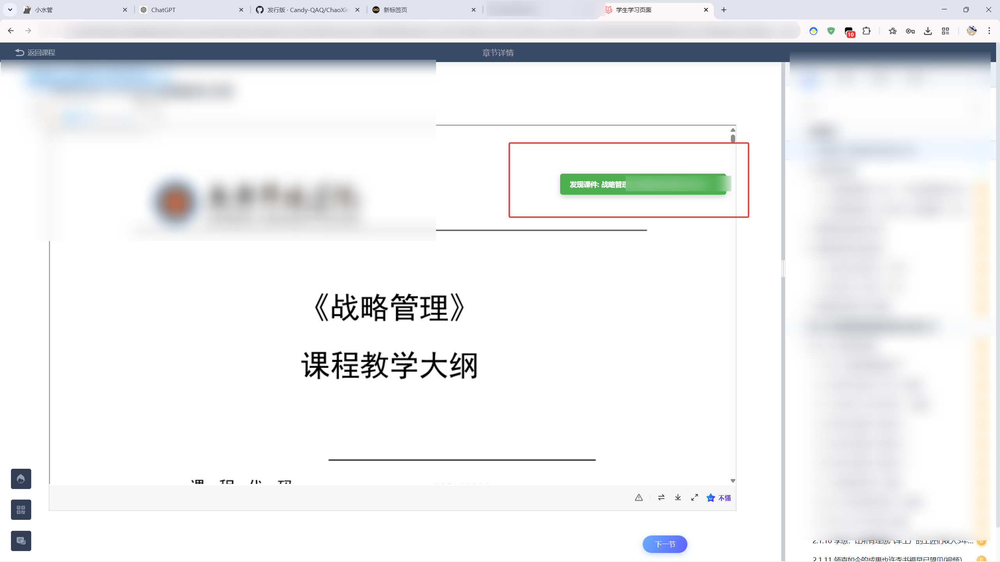

# 超星学习通课件下载器

一个用于下载超星学习通课件的浏览器插件。

## 功能说明

- 自动嗅探超星页面中的课件 PDF 链接
- 在右上角显示绿色悬浮下载按钮
- 直接下载课件文件
- 按课件名称保存下载文件

## Release 文件说明

每个版本的 Release 通常会提供以下文件：

- `ChaoXing-PPT-Download-vX.Y.zip`
  - 推荐使用
  - 用于解压后手动加载扩展
- `ChaoXing-PPT-Download-vX.Y.crx`
  - 已打包的浏览器扩展文件
  - Chrome 可能显示“非商店扩展”提示

## 安装方法

### 方法一：加载解压后的插件（推荐）

1. 下载 Release 中的 `zip` 文件并解压
2. 打开浏览器扩展管理页面
   - Edge: `edge://extensions`
   - Chrome: `chrome://extensions`
3. 开启开发者模式
4. 点击“加载已解压的扩展”
5. 选择解压后的插件目录

### 方法二：使用 CRX

1. 下载 Release 中的 `crx` 文件
2. 按浏览器当前策略安装
3. Chrome 可能显示“非商店扩展”提示，这是正常现象
4. 如果浏览器限制直接安装 `crx`，优先使用上面的“加载已解压的扩展”方式

## 从源码安装

如果你是从仓库源码直接安装，请确认以下文件位于同一目录：

- `manifest.json`
- `background.js`
- `content.js`
- `injected_spy.js`
- `logo.png`

然后按“加载已解压的扩展”的方式导入该目录。

## 使用方法

1. 安装成功后，打开超星学习通的章节页面
2. 进入含有 PPT、Word 或 PDF 预览的页面
3. 按下 `F5` 刷新页面
4. 如果页面中有可下载课件，右上角会出现绿色按钮
5. 点击按钮后，浏览器会直接开始下载

## 效果演示

